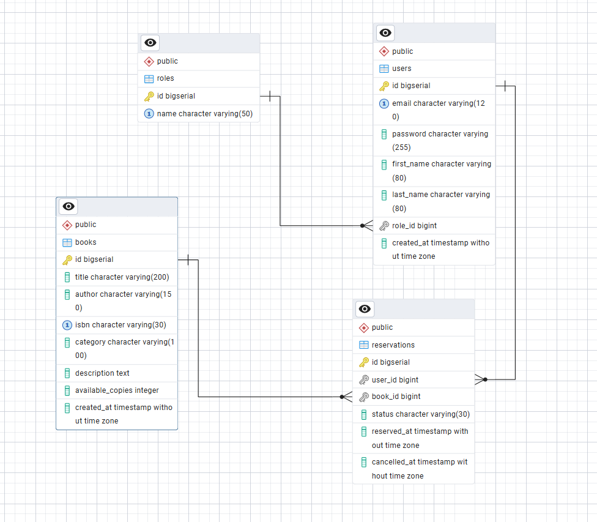
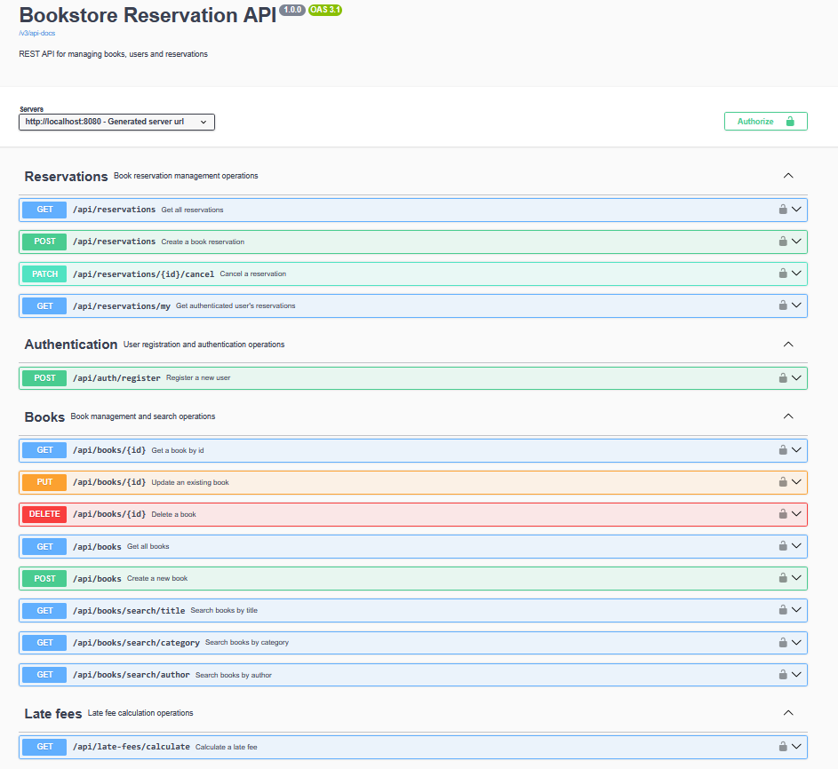
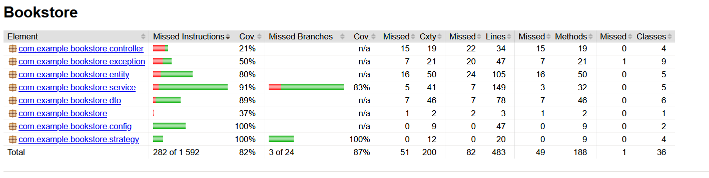

# Bookstore Reservation System

Aplikacja REST API do zarządzania książkami, użytkownikami i rezerwacjami.

## Funkcjonalności

- rejestracja użytkowników,
- uwierzytelnianie HTTP Basic,
- role USER i ADMIN,
- zarządzanie książkami,
- wyszukiwanie książek,
- rezerwowanie i anulowanie rezerwacji,
- obliczanie opłat z wykorzystaniem wzorca Strategy,
- dokumentacja Swagger/OpenAPI.

## Technologie

- Java
- Spring Boot
- Maven
- Spring Web
- Spring Data JPA
- Spring Security
- Hibernate
- PostgreSQL
- Flyway
- Docker
- Swagger/OpenAPI
- JUnit
- Mockito
- JaCoCo

## Uruchomienie

```bash
docker compose up -d
mvn spring-boot:run
```
## Swagger

http://localhost:8080/swagger-ui/index.html

## Role użytkowników

#### USER:
##### -przeglądanie książek,
##### -wyszukiwanie książek,
##### -tworzenie rezerwacji,
##### -przeglądanie własnych rezerwacji,
##### -anulowanie własnych rezerwacji.
#### ADMIN:
##### -dodawanie książek,
##### -edycja książek,
##### -usuwanie książek,
##### -przeglądanie wszystkich rezerwacji,
##### -anulowanie dowolnej rezerwacji.

## Diagram ERD



## Swagger UI



## Testy

